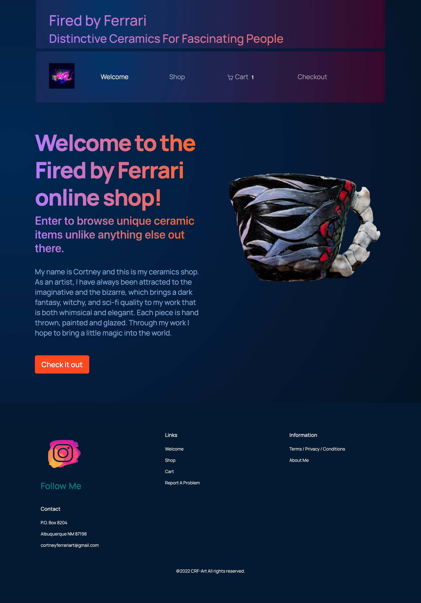
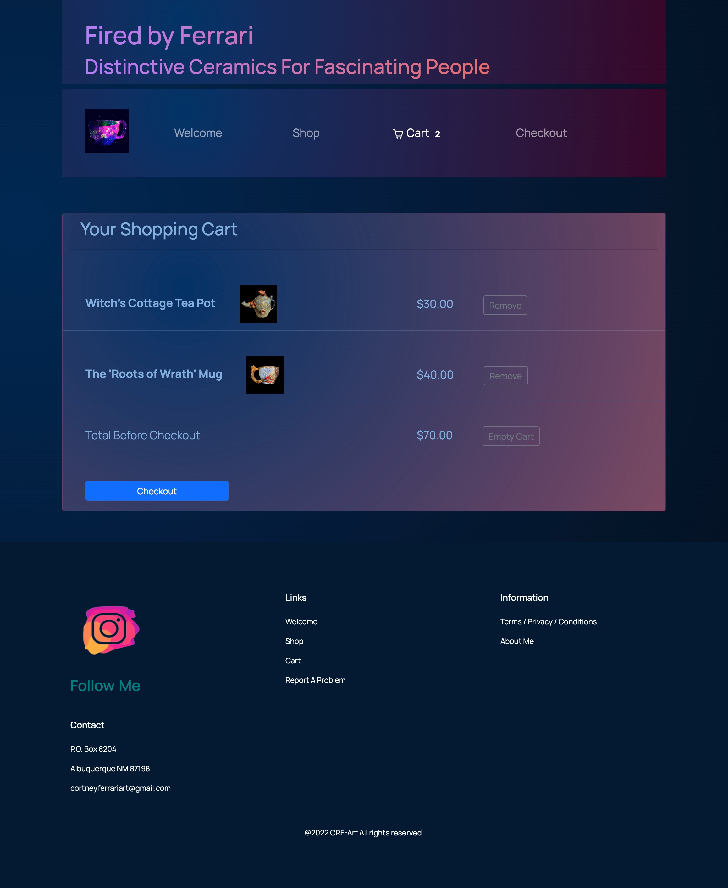

## E-Commerce Ceramics Shop "Fired By Ferrari"

A fully fleshed out web shop from landing page to email reciepts and shipment confirmation and tracking info.

## Table of contents

- [General info](#general-info)
- [Live Site](#project-live-site)
- [Project Video](#project-video)
- [Technologies](#technologies)
- [Features](#features)
- [Inspiration](#inspiration)
- [Contact](#contact)

## General info

This is a mobile responsive frontend focused project intended to delevelop and showcase my skills in React.js. It incorporates advanced React & JavaScript topics. This site relies on API's from the CMS platform Commerce.js, Stripe and Stripe Elements to process card payments, and React-Three-Fiber for incorporating an interactive 3d product model.

<div align="center">Landing Page: </div>
<br/>
<div align="center">
<kbd>

</kbd>
</div>
<div align="center">Cart Component: </div>
<br/>
<div align="center">
<kbd>

</kbd>
</div>

## Project Live Site

[Click to view live site](https://cortneyferrari.com/)

## Project Video

[Click to view video demo](comming soon)

## Technologies

- JavaScript (ES6)
- HTML5
- CSS3
- React.js - version 18.1.0
- React-DOM - version 18.1.0
- React Stripe Elelements
- Reactstrap - version 9.0.2
- Commerce.js version 2.8.0
- React-Hook-Form version 7.26.1
- Three.js version 0.140.0
- React-three/fiber version 8.0.13

## Code Examples

### Three.js/ react-three/fiber

```
import React, { Suspense } from "react";
import { Canvas } from "@react-three/fiber";
import Controls from "./Controls";
import Model from "./Scene";

function Animation(props) {
  return (
    <Canvas shadows dpr={[1, 2]} camera={{ position: [3, 3, 4], fov: 750 }}>
      <Controls
        autoRotate
        enablePan={false}
        enableZoom={false}
        enableDamping
        dampingFactor={0.5}
        rotateSpeed={1}
        maxPolarAngle={Math.PI / 2}
        minPolarAngle={Math.PI / 2}
      />
      <ambientLight intensity={0.5} />
      <pointLight intensity={1} position={[-10, -25, -10]} />
      <spotLight
        castShadow
        intensity={8}
        angle={Math.PI / 8}
        position={[25, 25, 15]}
        shadow-mapSize-width={2048}
        shadow-mapSize-height={2048}
      />

      <Suspense fallback={null}>
        <Model position={[0, -1, 0]} rotation={[Math.PI / 0.5, 0, 0]} />
      </Suspense>
    </Canvas>
  );
}

export default Animation;

```

### JavaScript/React.js

```
function MainComponent() {
  const [products, setProducts] = useState([]);
  const [cart, setCart] = useState({});
  const [order, setOrder] = useState({});
  const [errorMessage, setErrorMessage] = useState("");

  const fetchProducts = async () => {
    const { data } = await commerce.products.list();
    setProducts(data);
  };

  const fetchCart = async () => {
    setCart(await commerce.cart.retrieve());
  };

  const handleAddToCart = async (productId, quantity) => {
    const contents = await commerce.cart.contents();
    const alreadyIn = contents.some(
      (element) => element.product_id === productId
    );
    if (!alreadyIn) {
      const { cart } = await commerce.cart.add(productId, quantity);
      setCart(cart);
      alert("Added!");
    } else {
      alert("That one is already added");
      return;
    }
  };

  const handleRemoveFromCart = async (lineItemId) => {
    const { cart } = await commerce.cart.remove(lineItemId);
    setCart(cart);
  };

  const handleEmptyCart = async () => {
    const { cart } = await commerce.cart.empty();
    setCart(cart);
  };

  const refreshCart = async () => {
    const newCart = await commerce.cart.refresh();
    setCart(newCart);
  };

  const handleCaptureCheckout = async (checkoutTokenId, newOrder) => {
    try {
      const incomingOrder = await commerce.checkout.capture(
        checkoutTokenId,
        newOrder
      );
      setOrder(incomingOrder);
    } catch (error) {
      setErrorMessage(error.data.error.message);
    }
  };

  useEffect(() => {
    fetchProducts();
    fetchCart();
  }, []);

```

## Features

- Fully functional e-commerce web application utilizing functional components, hooks, promises and asyncrounous operations.
- Photo-realistic 3D product model with grab and spin interaction.
- A multi-step checkout Form using react-hook-form to capture customer information and send order info to Commerce.js
- Frontend CSS styles and layout with react-bootstrap.
- Cart remove/empty functionality and persistence after reload and leave/return for 24 hours.
- Link for client to report a problem or error to my bug tracker full stack app.

## Status

The project is deployed and in use by the creator. Public may use repo as needed.

## Inspiration

An appreciation for the artist who creates the ceramics inspired the idea for this site. I also intended to challenge myself as a new developer and gain familiarity with popular modern technologies such as CMS platforms, Stripe, and 3D modeling.

## Contact

Created by [Jesse Hall](https://www.linkedin.com/in/jessehall/)
Feel free to contact me for any questions!

```

```
